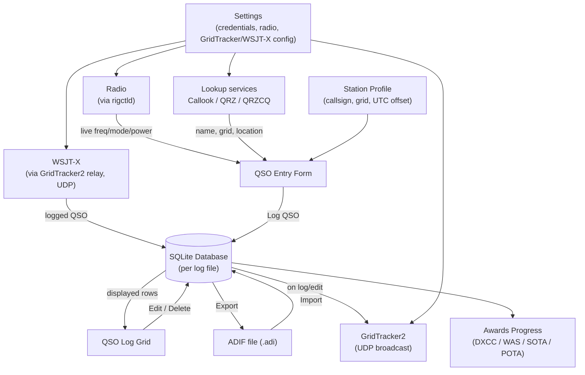

# CvarcLogger — Program Overview and Data Flow

*Conejo Valley Amateur Radio Club Logger. Program by W6CSM.*

## What it is

CvarcLogger is a Windows desktop program for logging amateur radio contacts (QSOs). It's built
for club members who want a straightforward, offline-first logbook: log a contact in a few
keystrokes, optionally have the radio and online callsign lookups fill in details automatically,
track progress toward awards like DXCC, Worked All States, SOTA, and POTA, and exchange logs with
other software (QRZ Logbook, LoTW, etc.) via the standard ADIF file format.

Everything lives in one SQLite file that travels with the program — no external database server.
It ships two ways: a self-contained `.exe`/`.zip` that runs directly with no install step, and a
Windows installer (Inno Setup) that adds a normal Apps & Features entry under `C:\CvarcLogger`.
Both contain the same program; the installer is just a more conventional install/uninstall path.

## What it does, at a glance

- **Logs QSOs** with a dedicated entry form (callsign, band, mode, RST, name, grid, location,
  SOTA/POTA references, and more), either typed by hand or auto-filled from the radio and lookup
  services.
- **Controls the radio (CAT)** through Hamlib's `rigctld`, reading frequency/mode/TX power live and
  pushing Band/Frequency/Mode/TX Power into the entry form as you tune.
- **Looks up callsigns** against Callook.info, QRZ.com, and QRZCQ.com, merging whichever fields
  each service actually provides.
- **Shows the whole log** in a sortable, searchable, customizable grid, with edit/delete and
  clipboard copy/paste of QSOs.
- **Imports and exports ADIF** (`.adi`) files, the standard ham radio log interchange format, so
  logs can move to/from QRZ Logbook, LoTW, and other loggers.
- **Receives QSOs from WSJT-X**, relayed through GridTracker2 over UDP, and logs them automatically
  with the same online lookup the manual entry form uses.
- **Broadcasts QSOs to GridTracker2** over UDP in real time, so a contact you log shows up on
  GridTracker's map immediately.
- **Tracks awards progress**: DXCC entities and US states worked/confirmed (Worked All States),
  plus SOTA's Mountain Goat and POTA's activator award tiers, all computed from the logged QSOs.
- **Supports multiple station profiles** (callsign, grid, UTC offset/DST, etc.), so one install can
  serve more than one operator or operating location.
- **Supports multiple independent log files** (separate `.db` databases), so contest logs or
  alternate callsigns can be kept apart from the everyday log.

## Program structure

The code is split into three .NET projects, each with a distinct job, plus a test project:

| Project | Responsibility |
|---|---|
| **CvarcLogger.Core** | Logic with no UI or database dependency: ADIF reading/writing, callsign lookup clients, CAT/rig control protocol, awards calculations, grid-square math, band/mode data. |
| **CvarcLogger.Data** | The SQLite database: EF Core `DbContext`, migrations, and repositories for QSOs, station profiles, SOTA/POTA activations, and DXCC reference data. |
| **CvarcLogger.App** | The WPF desktop UI (MVVM: Views + ViewModels), plus app-specific services that glue Core and Data together — settings storage, the lookup/CAT/GridTracker/WSJT-X coordinators, Windows credential encryption. |

This separation is what makes the ADIF and CAT logic independently testable — 158 automated tests
in `tests/CvarcLogger.Tests` cover Core and Data — without needing a running instance of the app.

## High-level data flow

## Process walkthroughs

### 1. Logging a QSO

1. The operator enters (or CAT/lookup auto-fills) a callsign, band, mode, and the other QSO
   fields on the entry form.
2. Pressing **Enter** or clicking **Log QSO** validates the fields, timestamps the contact, and
   writes it as a new row via the QSO repository.
3. The log grid, bound to the same in-memory collection, updates immediately without a re-query.
4. If GridTracker2 broadcasting is enabled, the same QSO is immediately re-encoded as an ADIF
   record and sent over UDP.

### 2. CAT radio control

1. On **Connect CAT**, CvarcLogger starts (or connects to an already-running) `rigctld` — Hamlib's
   TCP radio-control daemon — using the model, COM port, and baud rate configured for the active
   radio profile in Settings. It uses the copy of `rigctld.exe` bundled alongside the app
   automatically, unless the rigctld path setting has been pointed at a different, still-valid
   location.
2. Once connected, it polls the radio's current frequency, mode, and transmit power on a timer.
3. Frequency is converted to a ham band (`BandCalculator`) and the radio's raw mode string is
   mapped to CvarcLogger's Mode/Sub-Mode vocabulary (`RigModeMapper`); the radio's 0.0–1.0 power
   fraction is scaled by that radio slot's Max Power (W) calibration setting into an estimated
   TX Power (W). All three are pushed into the entry form — unless "Pause auto-fill" is checked, so
   a manual override during a QSO isn't immediately overwritten.

### 3. Callsign lookup

1. Typing a callsign and clicking **Lookup** (or triggering it from CAT) calls the
   `LookupCoordinator`.
2. It queries the operator's *preferred* service first (Callook, QRZ, or QRZCQ, set in Settings).
3. If that result is missing County — the one field none of the three provide consistently — it
   tries the remaining services in a fixed order and merges in whatever they find, stopping as
   soon as County is filled or all three have been tried.
4. Matched fields (Name, Grid, City, State, County, Country, DXCC entity) are written into the
   entry form.

### 4. ADIF import

1. The user picks an `.adi` file (e.g. a QRZ Logbook export or a LoTW download).
2. `AdifReader` parses it byte-by-byte rather than as a pre-decoded string, decoding each field
   leniently (UTF-8 first, Latin-1 fallback) — this recovers real-world files that aren't
   strictly ADIF-compliant instead of failing or silently corrupting accented names.
3. Each parsed record is mapped to a `Qso` (`AdifFieldMapper`), with the DXCC entity re-resolved
   from the callsign locally rather than trusted from the file, and written to the database.

### 5. ADIF export

1. The user picks which QSOs to export (all, or a filtered selection) and a destination file.
2. Each `Qso` is converted to an ADIF record (`AdifFieldMapper.ToAdifRecord`) and written
   (`AdifWriter`) with ADIF 3.1.4-conformant field-length encoding (measured in UTF-8 bytes, not
   .NET characters) so international names round-trip correctly.

### 6. WSJT-X log receiving

1. WSJT-X broadcasts each logged QSO to GridTracker2 (its own default UDP port, 2237).
2. GridTracker2 logs it as usual, then forwards the same message on to CvarcLogger over a second
   UDP port (2238) if its "Forward UDP messages" setting is enabled — CvarcLogger never receives
   WSJT-X's broadcast directly.
3. `WsjtxUdpListenerService` parses the relayed message and runs it through the same online
   callsign lookup the manual entry form uses, filling in only the fields WSJT-X left blank, before
   logging it. These QSOs are not broadcast back to GridTracker2, since it already has them.

### 7. Awards progress

`AwardsService` reads the full QSO log and computes, on demand: which DXCC entities have been
worked and/or confirmed, which U.S. states have been worked and/or confirmed for Worked All
States, progress toward SOTA's 1,000-point Mountain Goat award (summit info from the official SOTA
summit list, points counted once a summit has 4+ contacts on the same UTC date), and progress
toward POTA's activator award tiers (Bronze through Emerald, based on unique parks activated, each
needing 10+ unique callsigns on the same UTC date). None of this is a separate tracking table — all
of it is derived fresh from the log and from the SOTA/POTA reference data each time the Awards
window is opened.

### 8. Settings and credentials

Callsign-lookup, radio-control, GridTracker2, and WSJT-X settings live in a local JSON settings
file. QRZ/QRZCQ passwords are the exception: they're encrypted with Windows DPAPI
(`DpapiCredentialStore`) tied to the current Windows user account, so credentials never appear in
plain text on disk or in the QSO log itself.

## Where the data lives

- **Database**: an EF Core-managed SQLite file (`cvarclogger.db` by default), created next to
  `CvarcLogger.exe` by default (so a portable copy — e.g. on a USB drive — carries its data with
  it). Installs from before this behavior existed keep using their original
  `%LOCALAPPDATA%\CVARC Logger\` database instead of silently starting a second, empty one. A
  single install can hold more than one log (File > New Log / Open Log), each its own independent
  `.db` file.
- **Settings**: `%LOCALAPPDATA%\CVARC Logger\settings.json` — a separate location from the
  database, so it persists across portable copies, log switches, and reinstalls. Holds
  lookup/radio/GridTracker/WSJT-X configuration and encrypted credentials, but not QSO data.
- **rigctld**: a copy of Hamlib's `rigctld.exe` is bundled in a `hamlib\` folder next to the exe,
  so CAT control works out of the box without a separate Hamlib install. CvarcLogger uses that
  bundled copy automatically; a separately-installed copy is only used if the rigctld path setting
  is explicitly pointed at it.
