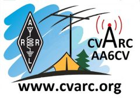

# CVARC Logger

> **Latest Release: v2.06** | [View all releases](https://github.com/csmaslin/cvarclogger/releases)
>
> **📥 Download Now:**
>
> ⬇️ **[CvarcLogger-Setup-2.06.exe](https://github.com/csmaslin/cvarclogger/releases/download/v2.06/CvarcLogger-Setup-2.06.exe)** (Windows Installer, 59.9 MB)
>
> ⬇️ **[CvarcLogger.V2.06.zip](https://github.com/csmaslin/cvarclogger/releases/download/v2.06/CvarcLogger.V2.06.zip)** (Portable ZIP, 59.9 MB)
>
> 🧪 **Pre-release available: [v2.07 (Beta)](https://github.com/csmaslin/cvarclogger/releases/tag/v2.07)** -- adds a new Contest Scoring Suite (Field Day, ARRL Sweepstakes, CQ WW, Sprints, NAQP) and a rebuilt in-app Help window. Not yet production; download at your own risk from the [v2.07 pre-release page](https://github.com/csmaslin/cvarclogger/releases/tag/v2.07).

---

**Version 2.06**  
Conejo Valley Amateur Radio Club  
Program by W6CSM

---

## Table of Contents

1. [Introduction](#introduction)
   - [What's New in Version 2.x](#whats-new-in-version-2x)
2. [Getting Started](#getting-started)
   - [Launching CVARC Logger](#launching-cvarc-logger)
   - [The Main Window](#the-main-window)
   - [Quick Start](#quick-start)
3. [Station Profiles](#station-profiles)
4. [Logging a QSO](#logging-a-qso)
   - [The QSO Entry Form](#the-qso-entry-form)
   - [Log Modes](#log-modes)
   - [Customizing the Entry Form](#customizing-the-entry-form)
   - [Callsign Lookup](#callsign-lookup)
   - [SOTA/POTA Reference Lookups](#sotapota-reference-lookups)
   - [Logging the QSO](#logging-the-qso)
   - [Contest and SKCC Logging](#contest-and-skcc-logging)
   - [Radio Control (CAT)](#radio-control-cat)
   - [Clearing the Log](#clearing-the-log)
5. [The QSO Log Grid](#the-qso-log-grid)
   - [Searching](#searching)
   - [Choosing and Reordering Columns](#choosing-and-reordering-columns)
   - [Editing a QSO](#editing-a-qso)
   - [Selecting Multiple QSOs](#selecting-multiple-qsos)
   - [Deleting QSOs](#deleting-qsos)
   - [Copy and Paste](#copy-and-paste)
   - [Net Roll-Call Markers](#net-roll-call-markers)
6. [Editing a QSO](#editing-a-qso-1)
   - [Contact Details](#contact-details)
   - [QSL Status](#qsl-status)
7. [Awards Progress](#awards-progress)
   - [DXCC](#dxcc)
   - [WAS (Worked All States)](#was-worked-all-states)
   - [Mountain Goat (SOTA)](#mountain-goat-sota)
   - [Parks on the Air (POTA)](#parks-on-the-air-pota)
   - [About DXCC Accuracy](#about-dxcc-accuracy)
8. [Importing and Exporting Logs (ADIF)](#importing-and-exporting-logs-adif)
   - [Importing](#importing)
   - [Exporting](#exporting)
   - [The Comment Field](#the-comment-field)
9. [Managing Multiple Logs](#managing-multiple-logs)
   - [Creating a New Log](#creating-a-new-log)
   - [Opening an Existing Log](#opening-an-existing-log)
   - [Where Logs Are Stored](#where-logs-are-stored)
10. [Settings](#settings)
    - [Callsign Lookup](#callsign-lookup-1)
    - [Radio Control (CAT Control)](#radio-control-cat-control)
    - [GridTracker2](#gridtracker2)
    - [WSJT-X](#wsjt-x)
11. [Keyboard Shortcuts & Quick Reference](#keyboard-shortcuts--quick-reference)
12. [Tips & Troubleshooting](#tips--troubleshooting)
13. [Appendix A: Version History](#appendix-a-version-history)
14. [Appendix B: Credits](#appendix-b-credits)

---

## Introduction

CVARC Logger is a Windows desktop application for logging amateur radio contacts (QSOs), built by the Conejo Valley Amateur Radio Club (W6CSM). It is designed for fast, live, in-the-chair logging: whether you're hunting DX, running a high-speed contest, activating a summit or park, or working a club net, the program reshapes itself around how you operate rather than the other way around.

Version 2.x reworked the QSO Entry form and the sidebar around one idea: you should be able to shape the program around how you actually operate, not the other way around. Every field's position and visibility can be customized per Log Mode, sticky ("static") behavior is your choice field by field, SOTA/POTA lookups now happen locally and instantly, and the sidebar's mode buttons now pack two related modes into one button you click twice.

### Key Features

- **Adaptive Logging Modes.** Normal, Contest, SOTA, POTA, and four blank Custom tabs each reshape the entry form to show only the fields that activity needs. Contest mode adds a running Sequence number that auto-increments with each save, along with ARRL Sweepstakes/Field Day fields (Precedence, Check, Class) and SKCC member numbers. The Custom tabs start out blank so you can build and rename your own activity-specific layout.

- **A Fully Customizable, Drag-and-Drop Layout.** Click and drag any field to a new spot on the entry form -- drop it on top of another field and that field is bumped aside rather than overwritten. Tab always moves through fields in the order they actually appear on screen, so a custom layout never breaks keyboard navigation.

- **"Sticky" Fields.** Twelve core fields (Band, Frequency, Mode, Sub-Mode, RST Sent/Rcvd, Operator, TX Power, My Grid, My State, My SOTA, and My POTA) can each be marked static to hold their value across every saved contact, or left unchecked so they clear themselves automatically after each log.

- **Automatic Callsign Lookup.** Type a callsign and CVARC Logger queries Callook.info (always available) and, if configured, QRZ.com or QRZCQ.com to fill in the operator's name, grid square, and location.

- **Local SOTA and POTA Databases.** Download the official summit and park reference rosters once with the refresh button, then typing a reference number shows its name instantly, even with no internet connection in the field.

- **Live Radio Control (CAT).** Connect over USB via Hamlib's rigctld, or over the network to an internet TCP/IP capable radio, and CVARC Logger auto-fills Frequency, Band, Mode, and TX Power as you tune.

- **Digital Mode Automation.** Contacts logged in WSJT-X are relayed through GridTracker2 over UDP and captured automatically, with QSOs also broadcast back out to GridTracker2 for live mapping.

- **Net Roll-Call Markers.** A checkbox on every log row lets a net controller track who's already been called on for their statement, so an interruption never loses their place.

- **A Powerful Log Grid.** Search, sort, and reorder columns; multi-select rows for bulk delete; and copy/paste directly to and from a spreadsheet.

- **Multiple Station Profiles and Log Files.** Keep separate callsigns, grid squares, or operating locations each with their own settings, and maintain entirely separate log files for different callsigns, contests, or locations.

- **ADIF Import/Export and Award Tracking.** Import and export logs compatible with QRZ Logbook, LoTW, and virtually every other logging program, with automatic progress tracking for DXCC, Worked All States (WAS), Mountain Goat (SOTA), and Parks on the Air (POTA).

### What's New in Version 2.x

- **Sidebar redesigned** around toggle tabs: instead of one button per mode, related modes now share a button you click twice to flip between (Normal/Contest, SOTA/POTA), plus two fully customizable spare tabs ("Undef-1/Undef-2" and "Undef-3/Undef-4") you can rename and configure for whatever your club needs.

- **Net roll-call markers**: a checkbox at the left of every log row, next to its number, lets a net controller mark each station as already called on. A Clear Net Markers button resets everything for the next net.

- **The Delete button** (removes selected rows from the log grid) is back on the action ribbon.

- **Customizable entry form layout**: click and drag any field on the QSO Entry form to a different position, from anywhere on the field (not just its label) -- the layout is remembered independently for each Log Mode, and the form now fits 6 fields per row instead of 5.

- **Per-mode field visibility** with renameable tabs: the Columns/Tabs window has one tab per Log Mode, each with its own set of shown/hidden fields, and each tab's name can be renamed (e.g. rename "Contest" to "Field Day").

- **Per-field "static" toggle**: a checkbox next to Band, Freq, Mode, Sub-Mode, RST Sent, RST Rcvd, Op, TX(W), My Grid, My State, My SOTA, and My POTA lets you choose whether that field keeps its value across QSOs or clears after each one.

- **SOTA/POTA reference lookups**: download a local copy of the official SOTA summit list and POTA park list, then typing a reference number shows its name right on the entry form -- no per-contact internet lookup needed.

- **QSO log grid search box**: filter the log live by callsign, name, grid square, or city, with a Clear button to return to the full list.

- **Tooltips** on every button throughout the program.

- **Entry form fixes**: Tab now moves between fields in the order they actually appear on screen; Enter now logs the QSO from anywhere on the form.

- **Edit QSO window** restyled to match the rest of the program, with larger text and clearer focus highlighting.

- **Start/End/Lookup ribbon buttons** relabeled Start Clock/End Clock/Call Lookup for clarity.

- **Awards window**: all four award grids now alternate row shading, matching the log grid.

---

## Getting Started

### Launching CVARC Logger

CVARC Logger is a self-contained Windows application -- no installation of the .NET runtime is required. Run CvarcLogger.exe directly (portable copy) or use the Windows Setup installer, which adds an Apps & Features entry and Start Menu shortcut and installs to C:\CvarcLogger by default.

On first launch (or any time the active log has no station profile yet), the Station Profiles window opens automatically before the main window appears. A callsign and a valid UTC offset are required before it can be closed -- the program cannot be used for logging without at least one station profile on record. The first profile you save is automatically marked as the default.

If Hamlib (rigctld, used for CAT radio control) is not found on the machine, CVARC Logger offers to open the Hamlib download page so you can install it. This is optional -- the program logs QSOs normally without it; only radio control (auto-filling Frequency/Band/Mode from the rig) needs it.

### The Main Window

The main window is organized into five areas:

- **Banner (top)** -- the club logo, program title, and club name.
- **Sidebar (left)** -- File, Station, CAT, Lookup, and Columns/Tabs buttons; four Log Mode toggle tabs; and Award progress.
- **QSO Entry form (upper right)** -- where you type in the details of the contact you're logging.
- **Action ribbon (middle)** -- CAT connection status, Start Clock/End Clock, Call Lookup, Log QSO, Columns/Tabs, and Delete.
- **QSO Log Grid (lower right)** -- every contact logged so far, searchable and sortable, with a net roll-call marker on each row.

A status bar at the bottom of the window shows the total QSO count, the active log's file name, and a program credit. Hovering over any button anywhere in the program shows a short tooltip describing what it does.

### Quick Start

1. **Set up your identity**: open Station Profiles (sidebar) and confirm your callsign, grid square, and UTC offset are set.
2. **Type the callsign**: click into the Callsign field on the entry form and type the station you're contacting.
3. **Trigger the lookup**: click Call Lookup, or just keep typing -- Log QSO runs a lookup automatically if you haven't clicked Lookup yet -- to pull in the operator's name, grid, and location.
4. **Log the exchange**: confirm the frequency/band and fill in the signal report (RST Sent/Received) and any other fields you want for this QSO.
5. **Save the QSO**: press Enter while still in the Callsign field, or click Log QSO. The contact appears immediately at the top of the QSO Log Grid.

---

## Station Profiles

A station profile holds the identity CVARC Logger uses when logging: your callsign, grid square, location, and time zone offset. Multiple profiles let you switch quickly between, for example, your home station and a portable/POTA setup with a different callsign or grid.

### Managing Profiles

Open Station Profiles from the sidebar or the Station menu. The profile list is on the left (the default profile shown in bold); its details are on the right. Click + New Profile to start one, Save to keep changes, Delete to remove the selected profile, or Close to exit. Selecting a different profile on the entry form re-seeds Op/QTH/My Grid/My State/My County/My SKCC # from that profile -- any of those you've since customized as "not static" will still clear normally on the next QSO regardless of which profile is active.

---

## Logging a QSO

### The QSO Entry Form

The entry form holds every field a QSO can carry, laid out 6 fields to a row. Which fields are visible, and where they sit on the form, both depend on the current Log Mode and can be further customized. A handful of fields are always shown regardless of mode: Station, Callsign, Date/Time (UTC), Local Time, Band, Freq (MHz), and Mode.

Several fields carry their value over from one QSO to the next instead of clearing, since they typically don't change contact to contact during one operating session -- Band, Freq, Mode, Sub-Mode, RST Sent, RST Rcvd, Op, TX(W), QTH, My Grid, My State, My County, My SKCC #, My SOTA, and My POTA. Twelve of these show a "static" checkbox right next to the field's label (Band, Freq, Mode, Sub-Mode, RST Sent, RST Rcvd, Op, TX(W), My Grid, My State, My SOTA, My POTA) -- uncheck it if you'd rather that one field clear after every QSO like Name or Grid Square does.

The field the text cursor is currently in shows a thicker, blue-highlighted border, so it's always clear where you're typing. Pressing Tab moves between fields in the order they actually appear on the form.

Date/Time (UTC) and Local Time tick forward live, once per second, while the form is idle. Typing a manual or backdated time stops the live tick for that entry; seconds are optional when typing by hand. The Start Clock button freezes Date/Time (UTC) at the current instant; End Clock stamps the current instant into Time Off (UTC).

### Log Modes

A Log Mode decides which fields show up on the entry form and in the log grid -- Contest mode, for example, adds Precedence/Check/Class and hides fields a contest exchange never uses. Switching modes doesn't lose anything: your log keeps every QSO from every mode together in one place, and each mode remembers its own field layout independently.

The sidebar has 5 buttons for this, but they cover 9 modes total, because 4 of the buttons are toggle tabs: each one is shared by two modes, and you click it once to switch to that tab, then click it again to flip between its two modes.

1. Click a toggle tab that isn't currently active (its button isn't highlighted blue): the program switches to whichever of its two modes you were on last time you used that tab.
2. Click the same toggle tab again, now that it's already active (its button is highlighted blue): the program flips over to the tab's other mode.
3. Click a different tab, then come back later: the tab you left remembers exactly which of its two modes it was showing, so you pick up right where you left off.

### Customizing the Entry Form

Two independent customizations are available, both saved per Log Mode:

**Drag-and-drop positioning**: click and drag any field to a different spot on the form -- you can grab it anywhere on the field, including its input box, not just its label. A plain click still works normally; only an actual drag repositions the field. If you drop it on a spot another field already occupies, that field is bumped to the next open spot in reading order rather than being overwritten.

**Columns/Tabs window**: click Columns/Tabs (sidebar or ribbon) to open it. It has one tab per Log Mode plus an All tab; select a tab to choose which fields are shown for that mode specifically. All and None buttons show or hide everything on the current tab at once.

### Callsign Lookup

Click Call Lookup, or just leave the Callsign field and let Log QSO trigger it automatically if you haven't looked it up yet, to query Callook.info (always available) and, if configured, QRZ.com or QRZCQ.com for the station's name, grid square, and location. Fields already filled in by hand are never overwritten by a lookup.

### SOTA/POTA Reference Lookups

Typing a SOTA summit code into the SOTA or My SOTA field, or a POTA park reference into the POTA or My POTA field, looks it up against a local reference database and shows the summit or park name right below the field. Entries are automatically forced to uppercase as you type, and the lookup runs live -- no need to click elsewhere first.

The local database has to be downloaded before lookups will find anything. Click the small ↻ button next to the SOTA or POTA field to download (or refresh) that database.

### Logging the QSO

Click Log QSO, or press Enter anywhere on the entry form, to save the contact. After logging, the fields that aren't marked static clear for the next contact, the Date/Time (UTC) field jumps to the current time, and the new QSO appears at the top of the QSO Log Grid.

One exception: if you're in an editable dropdown (Band, Mode, Sub-Mode) with its list open, the first Enter just closes that dropdown -- a second Enter then logs the QSO.

### Contest and SKCC Logging

Switch to Contest mode to log ARRL Sweepstakes or Field Day exchanges: Precedence (a dropdown showing the full ARRL definition for each category), Check, and Class. The Sequence # field tracks a running exchange serial -- Start begins counting at 1 and auto-increments after every logged QSO; Reset zeroes it and stops the count until Start is pressed again.

SKCC (Straight Key Century Club) numbers: your own is set once in Station Profiles and shown automatically as My SKCC #; the contacted station's SKCC number is entered per QSO in the SKCC # field.

### Radio Control (CAT)

Connect the CAT button (action ribbon) connects or disconnects live radio control, which auto-fills Frequency, Band, Mode, Sub-Mode, and TX Power as you tune. Configure which radio and connection method to use under CAT (sidebar).

### Clearing the Log

Clear Database (File Operations, or directly on the entry form depending on your layout) permanently deletes every QSO from the currently active log. It asks a Yes/No confirmation first, so it can't be triggered by a single accidental click. This cannot be undone -- back up first if there's any doubt.

---

## The QSO Log Grid

Every logged QSO appears as a row in the grid, newest at the top by default. Row numbers on the left count chronologically (the oldest QSO is always 1) regardless of how the grid is currently sorted or filtered. Click any column header to sort by that column.

### Searching

A search bar sits directly above the grid. Typing filters the visible rows live, matching against Callsign, Name, Grid Square, or City. Click Clear (or clear the search box) to return to showing every QSO.

### Choosing and Reordering Columns

Click Columns/Tabs to choose which fields appear as grid columns, independently per Log Mode. Callsign and Station Callsign are always shown and can't be hidden. Drag a column header left or right to reorder it; drag its edge to resize it. Both column order and width are remembered across restarts.

### Editing a QSO

Double-click any row, or select it and click Edit, to open the Edit QSO window.

### Selecting Multiple QSOs

Ctrl+right-click a row to toggle it into or out of a multi-selection; Shift+right-click selects a range. A regular click still selects just one row.

### Deleting QSOs

Select one or more rows and click Delete on the action ribbon to remove them from the log. A confirmation prompt shows how many QSOs are about to be deleted before anything happens. This cannot be undone.

### Copy and Paste

With the grid focused, Ctrl+C copies the selected rows as tab-separated text, suitable for pasting straight into a spreadsheet. Ctrl+V reads tab-separated rows back from the clipboard and logs each one as a new QSO.

### Net Roll-Call Markers

When you're running a net, you often log check-ins as they come in, then during a lull go back down the list and call on each member in turn for their statement. Every row in the log grid has a small checkbox to the left of its row number. Click it once you've called on that station and they've given their statement.

These checkmarks are separate from your QSO records: they're not saved to the log file, don't export with ADIF, and don't affect anything else in the program. When the net ends, click Clear Net Markers (top-right of the search bar, above the grid) to uncheck every row at once, ready for the next net.

---

## Editing a QSO

The Edit QSO window shows every field a QSO can carry, laid out in wrapping rows, and lets you change any of them after the fact. Lookup re-runs the online callsign lookup for the callsign currently in the window; Save writes your changes back to the log; Cancel discards them. Pressing Enter anywhere in the window also saves.

### Contact Details

Every field from the main entry form is editable here, plus several that don't normally appear on the entry form itself: Freq Rx (MHz) for split operation, Continent, Station Callsign, Operator, My Grid/State/County, and the station's own UTC Offset/DST setting at the time of the QSO.

### QSL Status

A separate section tracks paper/electronic QSL confirmation: QSL Sent/Received (with dates) and LoTW Sent/Received (with dates), plus QSL Via for a QSL manager's callsign.

---

## Awards Progress

Open Awards from the sidebar to see progress toward four awards, computed automatically from your log -- nothing needs to be entered manually beyond logging QSOs normally (and, for SOTA/POTA, the summit/park reference fields).

### DXCC

Shows Worked and Confirmed counts, a per-band QSO count strip, 5-Band DXCC progress (100+ confirmed entities on each of five bands), and a full entity grid with Worked/Confirmed/Phone/CW/Digital columns. Filter the entity grid to a single band with the Band dropdown.

### WAS (Worked All States)

Shows Worked and Confirmed counts out of 50, the same per-band QSO strip as the DXCC tab, and a 50-state grid with Worked/Confirmed/Phone/CW/Digital columns.

### Mountain Goat (SOTA)

Tracks progress toward SOTA's 1000-point Mountain Goat activator award. Type a summit code and click Add to track it -- its point value is looked up automatically from the SOTA summit list. Per SOTA's own rules, a summit only counts as activated once at least 4 contacts have been logged from it on the same UTC date; until then its points show in parentheses.

### Parks on the Air (POTA)

Tracks progress toward POTA's activator award tiers (Bronze 10, Silver 20, Gold 30, Platinum 40, Diamond 50, Ruby 100, Emerald 125 unique parks activated). A park counts as activated once 10 different callsigns are logged from it on the same UTC date.

### About DXCC Accuracy

DXCC entity resolution uses a bundled, community-assembled approximation of the ARRL DXCC prefix list, not the official ARRL data. If a contact shows the wrong entity or country, correct it directly on that QSO in the log grid.

---

## Importing and Exporting Logs (ADIF)

ADIF (Amateur Data Interchange Format) is the standard file format most logging programs, QRZ Logbook, and LoTW use to exchange QSO data. Import and Export are both available from File Operations (sidebar).

### Importing

Import ADIF reads an .adi/.adif file and adds its QSOs to the currently active log. QRZ Logbook exports are recognized specifically, including their confirmation-status fields. DXCC entities are re-resolved from each callsign on import.

### Exporting

Export ADIF writes the currently active log out to an .adi file. The suggested filename defaults to the log's database name plus a date/time stamp, so exports from different logs never overwrite each other by accident.

### The Comment Field

CVARC Logger has one free-text field, Comment, mapped to ADIF's COMMENT tag on both import and export.

---

## Managing Multiple Logs

CVARC Logger can work with more than one log database -- useful for keeping a contest log separate from your everyday log, for example. All log-file actions are under File Operations (sidebar).

### Creating a New Log

New Log... creates a new, empty log database file and switches to it immediately.

### Opening an Existing Log

Open Log... switches to a different existing log database file. The currently active log's file name is always shown in the status bar at the bottom of the main window.

### Where Logs Are Stored

A new, portable install keeps its database next to CvarcLogger.exe, so copying the whole install folder carries its data with it.

---

## Settings

### Callsign Lookup

Callook.info is used automatically and needs no configuration. Two additional sources can be configured with your own account credentials, stored encrypted on this machine only:

**QRZ.com XML Data API**
Requires a QRZ.com XML subscription. Enter your QRZ.com username and password, click Save, then Test to confirm the connection works.

**QRZCQ.com XML API**
Requires a Premium QRZCQ account. Configured the same way as QRZ.com above, in its own section.

### Radio Control (CAT Control)

Choose a CAT Source: Off, USB (Hamlib), or Internet -- only one is active at a time.

**USB / Serial (Hamlib)**
Uses Hamlib's rigctld as a TCP backend for USB-connected radios. Select your radio from the Radio (Hamlib) dropdown; each radio slot has its own Hamlib Model ID, COM Port, Baud Rate, and Max Power (W). Max Power (W) is never auto-filled -- adjust it if the entry form's TX Power doesn't match your radio's own power meter reading.

**Internet Control (TCP/IP Capable Radios)**
Reads frequency, band, mode, sub-mode, and TX power from an internet TCP/IP capable radio over the network, using its native TCP command protocol (default port 9200).

### GridTracker2

Enable GridTracker2 broadcast sends every logged or edited QSO out over UDP so GridTracker2 can plot it in real time. Configure the Host and Port (default port 2240).

### WSJT-X

Enable WSJT-X log receiving (UDP 2238) automatically adds QSOs logged in WSJT-X to CVARC Logger's log. WSJT-X should broadcast to GridTracker2 as usual; GridTracker2's own "Forward UDP messages" setting then relays that same message on to CVARC Logger on port 2238.

---

## Keyboard Shortcuts & Quick Reference

(Detailed shortcuts to be added here based on Section 11 of the manual)

---

## Tips & Troubleshooting

### Enter doesn't log the QSO

Enter logs the QSO from anywhere on the entry form, with one exception: in an editable dropdown (Band, Mode, Sub-Mode) with its list open, the first Enter just closes that dropdown, matching normal Windows behavior -- press Enter a second time, or click Log QSO instead.

### CAT stopped updating

Confirm the CAT status indicator on the action ribbon shows connected. If it dropped, click Connect the CAT again. For USB radios, confirm the correct COM port is still selected in CAT Control.

### A contact shows the wrong DXCC entity or Country

DXCC resolution uses a bundled prefix list, not official ARRL data. Correct the entity directly on that QSO in the log grid; award totals update automatically.

### New Log / Open Log doesn't seem to do anything immediately

Check the status bar at the bottom of the main window -- it always shows the currently active log's file name, confirming the switch took effect.

### County isn't filled in after Lookup

Not every lookup source returns a county for every location. Enter it manually if needed -- it won't be overwritten by a later lookup once it's set.

### TX Power (W) doesn't match the radio's own meter

Adjust the Max Power (W) setting for that radio in CAT Control -- CAT reports power as a fraction of that value, not an absolute wattage.

### A field I want isn't on the entry form

Open Columns/Tabs (sidebar or ribbon) and check it on for the current Log Mode -- fields are shown/hidden independently per mode.

---

## Appendix A: Version History

Versions before 1.17 predate CVARC Logger's changelog and are not documented here.

**v2.07 (Beta)**
- **New Contests menu**: per-contest scoring tools for Field Day, ARRL Sweepstakes, CQ WW, Sprints (CW/SSB/RTTY plus the ARRL VHF Contest), and NAQP -- all labeled Beta pending real-world verification.
- **New in-app Help window**: the full user manual, including tables rendered as real grids, with a find/next search that jumps to and highlights matches. Kept in sync with the manual automatically on every build.
- **Cabrillo import** now saves the full contest header; the export dialog auto-fills from the last submission for the same contest.
- **ARRL Sweepstakes fixes**: USB/LSB now count as Phone-event modes (previously only the literal "SSB" tag counted); a new "Fill in Missing Sections" tool backfills ARRL Section from State/County for older QSOs.

**v2.06**
- **WSJT-X multicast reception** as an alternative to relaying through GridTracker2.
- **Cabrillo import/export** for contest logs.
- **CAT Control improvements**: baud rate dropdown, Internet Control radio-type dropdown (Elecraft K4/FlexRadio/Icom CI-V/Kenwood), USB test now actually polls the radio, rigctld auto-launch on by default.
- **Installer**: custom install directory; uninstall prompts to keep or remove the database.
- Tab key in the Callsign field now triggers automatic lookup.

**v2.05** (2026-08-17)
- **Resizable split between entry form and log grid**: drag the grey handle just under the button ribbon up or down to give either pane more room. Defaults to 50/50, remembers the position on exit.
- **Lookup button fix** in the QSO Edit window (was silently unbound in XAML; wired manually in code-behind as fallback).
- **"Clear & Lookup" button** in Edit QSO: empties the lookup-filled fields and fetches fresh data for a new callsign.

**v2.04**
- (Previous release notes to be added)

---

## Appendix B: Credits

CVARC Logger is developed for the Conejo Valley Amateur Radio Club.

**Program by W6CSM**

**Beta Testers**
Thank you to the CVARC members who tested early builds and reported issues throughout development.
